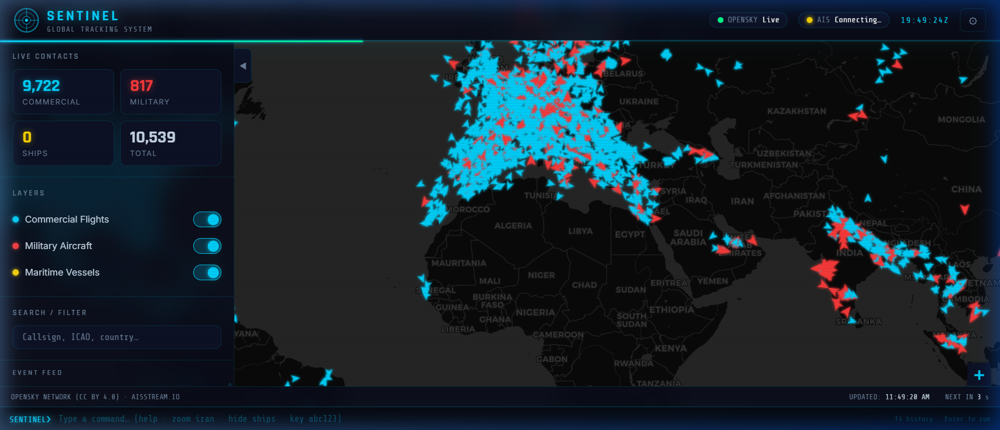
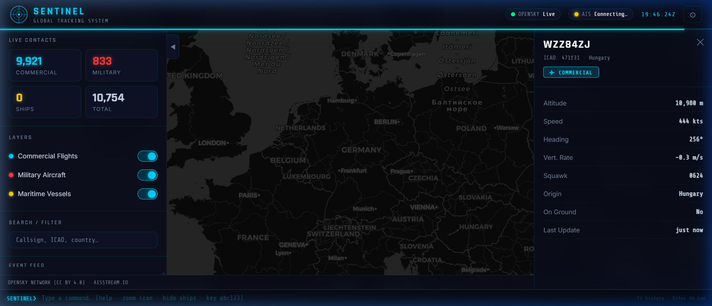
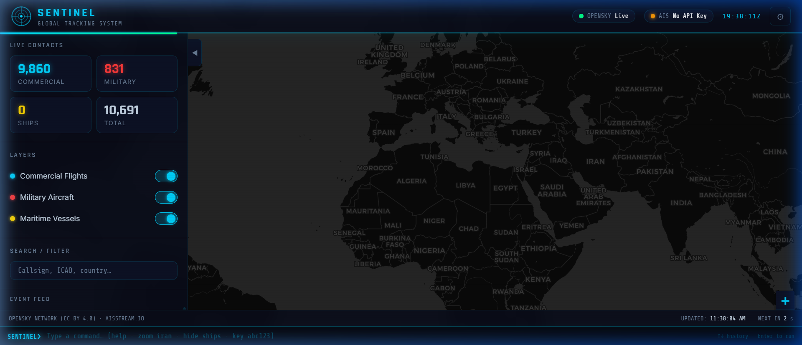
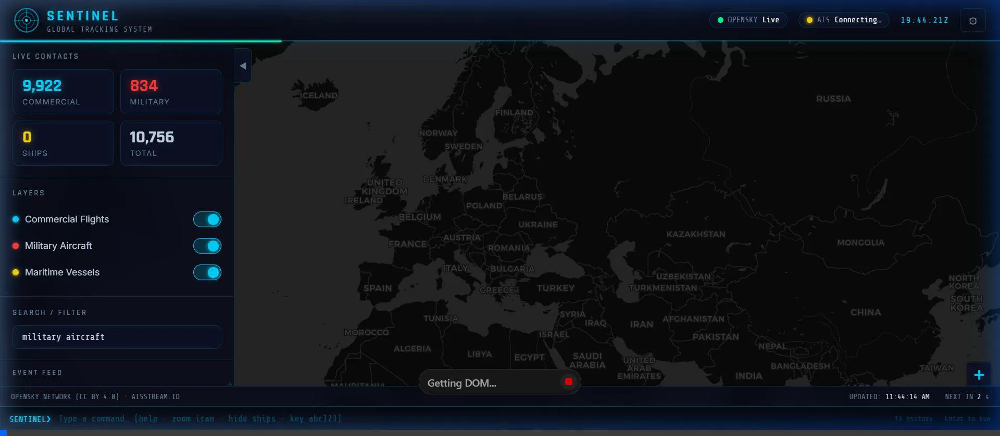

<div align="center">

# 🛰️ SENTINEL
### Global Flight, Ship & Military Aircraft Tracking System

[](https://github.com/ChozhanMurugan/sentinel-tracker)
[](https://opensky-network.org)
[](https://github.com/ChozhanMurugan/sentinel-tracker)
[](LICENSE)

**An open-source, Palantir-inspired real-time tracking dashboard for commercial flights, military aircraft, and maritime vessels — running entirely in your browser with zero cost.**

</div>

---

## 📸 Screenshots

### Global Dashboard — 10,000+ Live Contacts


### Aircraft Detail Panel — Click Any Marker for Live Data


### Zoomed View — Europe Air Traffic


### 🎬 Demo Recording


---

## ✨ Features

| Feature | Details |
|---|---|
| ✈️ **Live Flight Tracking** | 10,000+ commercial aircraft updated every 10 seconds |
| 🪖 **Military Aircraft Detection** | Identifies USAF, RAF, IRIAF, IAF, Russian, Chinese, and 15+ other air forces |
| 🚢 **Maritime Vessel Tracking** | Real-time AIS ship positions via WebSocket |
| ⌨️ **Command Terminal** | Type natural-language commands to control the map |
| 🗺️ **Interactive Map** | Dark military-ops aesthetic, click any marker for details |
| 🔍 **Search & Filter** | Filter by callsign, ICAO hex, or country in real-time |
| 📊 **Live Stats** | Contact counts updated on every data refresh |
| 💯 **100% Free** | No paid APIs, no backend server, no account needed for flights |
| 🌐 **No Installation** | Pure HTML/CSS/JS — runs in any modern browser |

---

## 🛰️ Data Sources (All Free)

| Source | Data | Refresh |
|---|---|---|
| [OpenSky Network](https://opensky-network.org) | All commercial & military flights worldwide | Every 10 seconds |
| [aisstream.io](https://aisstream.io) | Global maritime AIS ship positions | Real-time WebSocket |
| [CartoDB Dark Matter](https://carto.com/basemaps/) | Map tiles | On demand |

> **Note:** OpenSky anonymous access allows ~100 requests/day. [Register a free account](https://opensky-network.org/index.php?option=com_users&view=registration) to get unlimited access.

---

## 🚀 Quick Start

### Prerequisites

- Any modern browser (Chrome, Firefox, Edge, Safari)
- A local HTTP server to serve the files (required — browsers block `file://` modules)
- Git (to clone the repo)

### Option 1 — VS Code Live Server (Easiest)

1. **Install VS Code** from [code.visualstudio.com](https://code.visualstudio.com)
2. **Install the Live Server extension** — search "Live Server" by Ritwick Dey in Extensions (`Ctrl+Shift+X`)
3. Clone and open the project:
   ```bash
   git clone https://github.com/ChozhanMurugan/sentinel-tracker.git
   cd sentinel-tracker
   code .
   ```
4. Right-click `index.html` in the VS Code file explorer → **"Open with Live Server"**
5. Your browser opens automatically at `http://127.0.0.1:5500` — **done!**

---

### Option 2 — Python (Built into macOS/Linux, available on Windows)

```bash
git clone https://github.com/ChozhanMurugan/sentinel-tracker.git
cd sentinel-tracker

# Python 3
python -m http.server 8787

# Then open your browser and go to:
# http://localhost:8787
```

---

### Option 3 — Node.js / npx

```bash
git clone https://github.com/ChozhanMurugan/sentinel-tracker.git
cd sentinel-tracker

# One-liner — no install needed
npx serve . -p 8787

# Then open:
# http://localhost:8787
```

---

## 🚢 Setting Up Ship Tracking (AIS)

Ship tracking uses **aisstream.io** — a free, real-time AIS WebSocket feed.

### Step 1 — Get your free API key
1. Go to [aisstream.io](https://aisstream.io) and click **Sign Up**
2. Confirm your email — you'll receive an API key
3. No credit card required

### Step 2 — Enter your key in the app
**Option A — Command Terminal (fastest):**
Click the terminal bar at the bottom of the app and type:
```
key YOUR_AIS_KEY_HERE
```
Press **Enter**. Ships appear immediately and your key is saved in `localStorage` for future sessions.

**Option B — Settings UI:**
Click the **⚙** button in the top-right corner → paste your key → click **Save & Connect**.

**Option C — Bake it into the config (for personal use only):**
Open `js/config.js` and set:
```js
aisstreamKey: 'your-key-here',
```
> ⚠️ **Never commit your API key to a public GitHub repo.**

---

## ⌨️ Command Terminal

SENTINEL has a built-in terminal at the bottom of the screen. Click it and type commands — it understands natural language.

### Navigation
| Command | Result |
|---|---|
| `zoom europe` | Flies the map to Europe |
| `zoom iran` | Flies to Iran |
| `zoom india` | Flies to India |
| `zoom usa` | Flies to the United States |
| `zoom russia` | Flies to Russia |
| `zoom middle east` | Flies to the Gulf region |
| `zoom korea` | Flies to the Korean Peninsula |
| `zoom australia` | Flies to Australia |
| `zoom world` | Resets to global view |

Any region name works: `uk`, `france`, `germany`, `ukraine`, `china`, `japan`, `pakistan`, `israel`, `turkey`, `africa`, `atlantic`, `pacific` …

### Layer Control
| Command | Result |
|---|---|
| `hide military` | Hides military aircraft |
| `show military` | Shows military aircraft |
| `hide ships` | Hides maritime vessels |
| `show all` | Shows all layers |
| `hide commercial` | Hides commercial flights |
| `toggle ships` | Toggles maritime layer |

### Search & Filter
| Command | Result |
|---|---|
| `search AAL` | Shows only American Airlines flights |
| `filter UAE` | Filters by UAE callsigns/country |
| `find RCH` | Finds USAF Air Mobility Command flights |
| `clear` | Removes all filters |

### Settings
| Command | Result |
|---|---|
| `key abc123` | Sets your aisstream.io API key |
| `status` | Shows system status |
| `help` | Shows all available commands |

**Tips:**
- Press **↑ / ↓** to cycle through command history
- Commands are fuzzy — `"military off"` and `"hide military aircraft"` both work

---

## 🗺️ Using the Map

### Clicking a Marker
Click any aircraft or ship on the map to open the **Detail Panel** on the right side showing:
- Callsign & ICAO hex code
- Origin country
- Altitude (meters)
- Speed (knots)
- Heading (degrees)
- Vertical rate (climbing/descending)
- Squawk code
- Time of last update

### Layer Toggles (Sidebar)
The left sidebar has toggle switches for:
- ✈️ **Commercial Flights** (cyan markers)
- 🪖 **Military Aircraft** (red markers — pulse glow)
- 🚢 **Maritime Vessels** (gold markers — requires AIS key)

### Search Box
Type in the **Search / Filter** box in the sidebar to show only matching contacts. Searches callsign, ICAO24 hex, and country simultaneously.

### Zoom & Pan
- **Scroll wheel** — zoom in/out
- **Click + drag** — pan the map
- **Double-click** — zoom in on a point
- Use terminal commands like `zoom europe` to fly to any region instantly

---

## 🪖 Military Aircraft Detection

SENTINEL uses a two-layer heuristic system to flag military aircraft:

### Layer 1 — ICAO Hex Block Matching
Each country is allocated a block of ICAO 24-bit hex codes. SENTINEL flags aircraft whose hex code falls in known military blocks:

| Country | Air Force | ICAO Hex Range |
|---|---|---|
| 🇺🇸 United States | USAF / US DoD | `AE0000 – AEF FFF` |
| 🇬🇧 United Kingdom | RAF | `43C000 – 43CFFF` |
| 🇫🇷 France | Armée de l'Air | `3A0000 – 3A7FFF` |
| 🇩🇪 Germany | Luftwaffe | `3C4000 – 3C9FFF` |
| 🇷🇺 Russia | VKS | `781000 – 783FFF` |
| 🇨🇳 China | PLAAF | `710000 – 710FFF` |
| 🇮🇷 Iran | IRIAF | `730000 – 737FFF` |
| 🇮🇳 India | IAF | `800000 – 83FFFF` |
| 🇨🇦 Canada | RCAF | `500000 – 501FFF` |
| 🇦🇺 Australia | RAAF | `C80000 – C82FFF` |
| 🇳🇴 Norway | RNoAF | `440000 – 441FFF` |
| 🇩🇰 Denmark | RDAF | `458000 – 459FFF` |
| 🇫🇮 Finland | FiAF | `478000 – 478FFF` |
| 🇧🇪 Belgium | BAC | `4A0000 – 4A1FFF` |
| 🇳🇱 Netherlands | RNLAF | `460000 – 461FFF` |

### Layer 2 — Callsign Pattern Matching
Aircraft using known mil/gov callsign prefixes are flagged regardless of hex:

`RCH` (USAF AMC) · `SPAR` (VIP/AF2) · `FORTE` (TACAMO) · `DUKE` · `REACH` · `DOOM` · `NAVY` · `ARMY` · `USMC` · `IRI` / `IRIAF` (Iran) · `IAF` (India) · `VIP` (Indian Govt) …

> **Accuracy note:** Classification is heuristic — not authoritative. Some civilian aircraft in these hex ranges will be incorrectly flagged, and military aircraft squawking civilian codes may not be detected.

---

## 📁 Project Structure

```
sentinel-tracker/
├── index.html              # Main HTML shell + terminal bar
├── styles/
│   └── main.css            # Dark military UI (all CSS variables)
├── js/
│   ├── config.js           # ⚙️  All settings — edit this to customise
│   ├── api.js              # OpenSky REST + aisstream.io WebSocket
│   ├── canvas-layer.js     # 🚀  High-perf canvas renderer (10k+ markers)
│   ├── commands.js         # ⌨️  Semantic command parser
│   ├── map.js              # Leaflet map wrapper
│   ├── ui.js               # Detail panel, alerts, stats UI
│   └── app.js              # Main orchestrator & event wiring
├── screenshots/            # Demo screenshots & recordings
└── README.md
```

---

## ⚙️ Configuration

All settings live in `js/config.js`:

```js
const CONFIG = {
    // Map starting position and zoom
    mapCenter: [30, 0],
    mapZoom: 3,

    // How often to poll OpenSky (minimum 10s for anonymous access)
    flightRefreshMs: 10000,

    // Your aisstream.io key (or leave empty and use the terminal: key abc123)
    aisstreamKey: '',

    // Maximum aircraft markers rendered (reduce if performance is slow)
    maxFlightMarkers: 8000,
};
```

---

## 🛠️ How It Works

```
┌─────────────────────────────────────────────────────┐
│                   SENTINEL Browser App               │
│                                                      │
│  ┌──────────┐   REST Poll   ┌──────────────────┐    │
│  │  app.js  │─────10s──────▶│ OpenSky Network  │    │
│  │          │◀──────────────│  (flights data)  │    │
│  │          │               └──────────────────┘    │
│  │          │   WebSocket   ┌──────────────────┐    │
│  │          │◀──────live────│  aisstream.io    │    │
│  │          │               │  (AIS ships)     │    │
│  └────┬─────┘               └──────────────────┘    │
│       │                                              │
│       ▼                                              │
│  ┌──────────────┐   draws   ┌──────────────────┐    │
│  │ canvas-layer │──────────▶│  <canvas> element│    │
│  │  (RAF loop)  │           │  (10k+ markers)  │    │
│  └──────────────┘           └──────────────────┘    │
│                                                      │
│  ┌──────────────┐                                    │
│  │  commands.js │  ← terminal bar input              │
│  │  (semantic   │                                    │
│  │   parser)    │                                    │
│  └──────────────┘                                    │
└─────────────────────────────────────────────────────┘
```

---

## 🤝 Contributing

Contributions are welcome! Ideas for improvement:
- [ ] Clustering at low zoom levels
- [ ] Aircraft trail history lines
- [ ] Altitude-based color coding
- [ ] Export tracked contacts to CSV
- [ ] WebSocket OpenSky for lower latency
- [ ] More country callsign patterns

**To contribute:**
1. Fork the repo
2. Create a feature branch: `git checkout -b feature/my-feature`
3. Commit your changes: `git commit -m 'Add my feature'`
4. Push: `git push origin feature/my-feature`
5. Open a Pull Request

---

## 📜 License

MIT License — free to use, fork, and build on.

---

## 🙏 Acknowledgements

- [OpenSky Network](https://opensky-network.org) — CC BY 4.0 flight data
- [aisstream.io](https://aisstream.io) — free AIS WebSocket API
- [Leaflet.js](https://leafletjs.com) — open-source map library
- [CartoDB](https://carto.com) — dark map tiles
- [OpenStreetMap](https://www.openstreetmap.org) contributors

---

<div align="center">
Built with 🛰️ by <a href="https://github.com/ChozhanMurugan">ChozhanMurugan</a>
</div>
