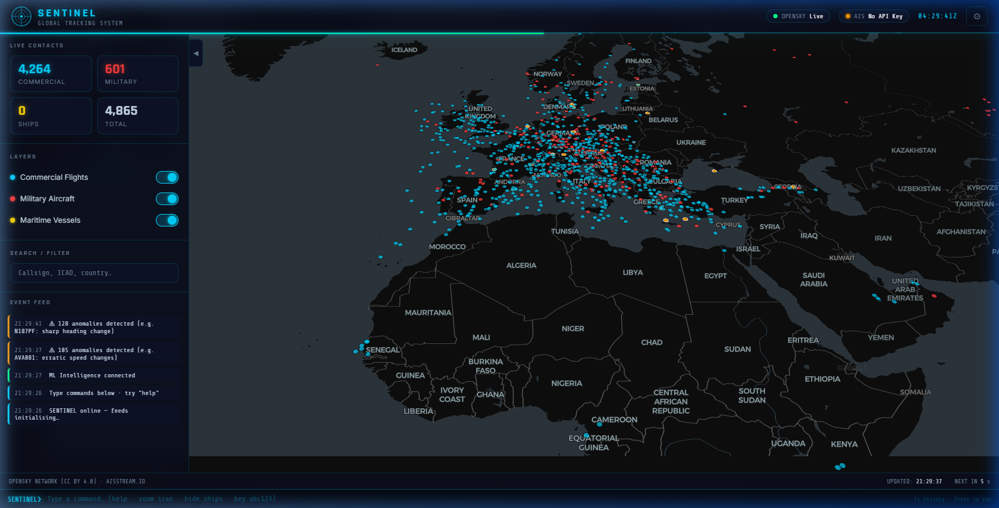
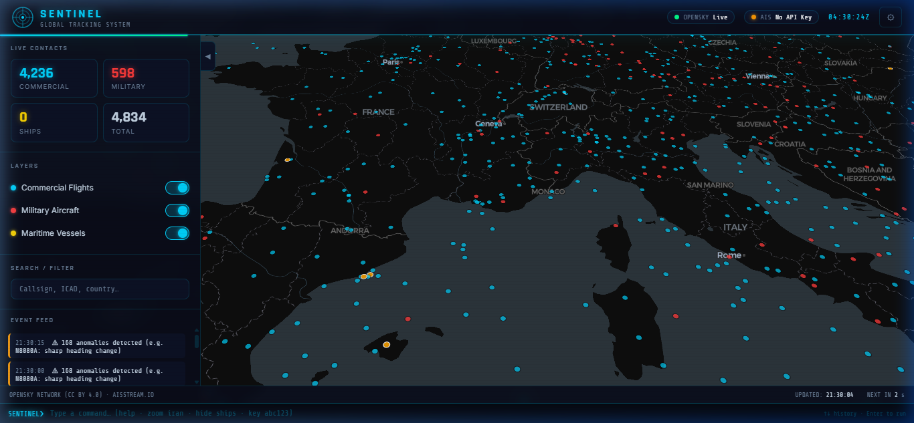
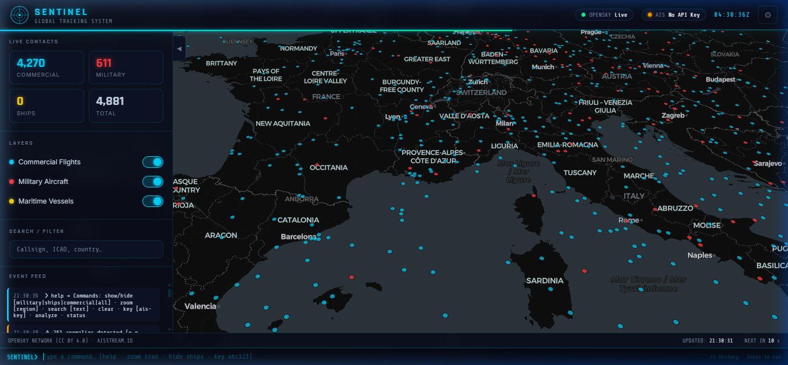
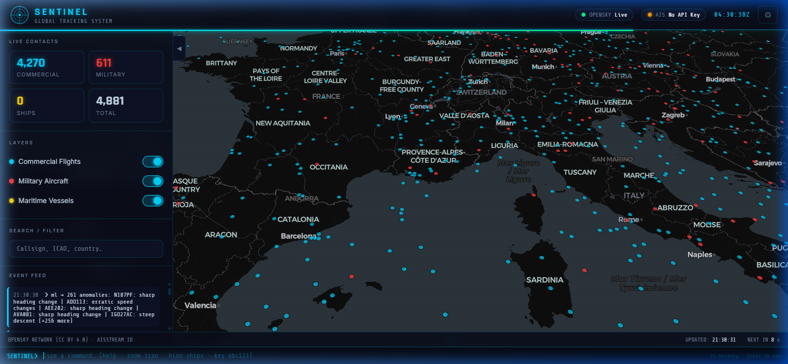
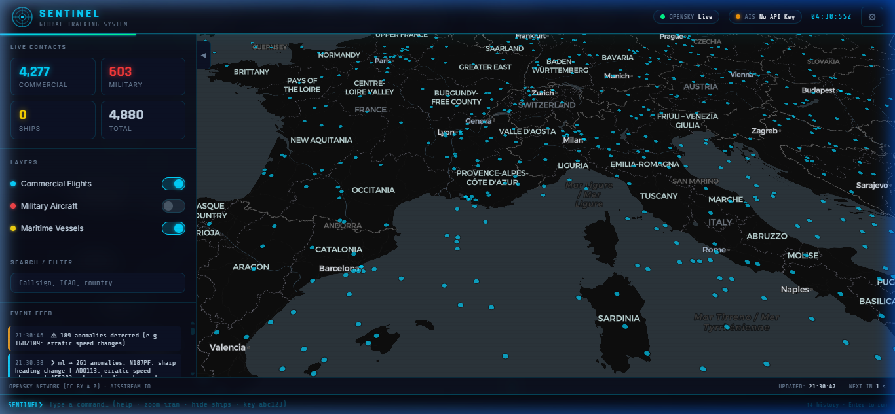

<div align="center">


# 🛰️ SENTINEL — Global Intelligence Tracking Platform

**Real-time flight, military aircraft & maritime vessel tracking — powered by a full-stack distributed architecture with a live machine learning anomaly detection engine.**

[](https://fastapi.tiangolo.com)
[](https://python.org)
[](https://kafka.apache.org)
[](https://scikit-learn.org)
[](https://www.timescale.com)
[](https://redis.io)
[](https://www.docker.com)
[](LICENSE)

*A Palantir-inspired, open-source intelligence platform tracking 5,000+ live contacts across air and sea — with a self-training Isolation Forest anomaly detection engine detecting 200+ behavioural anomalies per cycle in real time.*

</div>

---

## 📽️ Live Session Recording

> *The complete ML pipeline in action — anomalies streaming, military markers flagged, command terminal live.*


---

## 📸 Screenshots

<table>
  <tr>
    <td align="center" width="50%">
      <strong>🌍 Global Dashboard — 4,865 Live Contacts · ML Active</strong><br/>
      
    </td>
    <td align="center" width="50%">
      <strong>🪖 Europe — Commercial + Military Contacts</strong><br/>
      
    </td>
  </tr>
  <tr>
    <td align="center" width="50%">
      <strong>⌨️ Terminal — `help` Command</strong><br/>
      
    </td>
    <td align="center" width="50%">
      <strong>🧠 Terminal — Live ML Anomaly Output</strong><br/>
      
    </td>
  </tr>
  <tr>
    <td align="center" width="50%">
      <strong>🎛️ Layer Toggle — Military Hidden</strong><br/>
      
    </td>
    <td align="center" width="50%">
      <strong>✈️ Aircraft Detail Panel</strong><br/>
      
    </td>
  </tr>
</table>

---

## ✨ What SENTINEL Does

| Category | Feature | Detail |
|---|---|---|
| ✈️ **Flight Tracking** | Live ADS-B via OpenSky Network | 5,000–10,000+ aircraft, updated every 10 s |
| 🪖 **Military Intel** | ICAO hex block + callsign matching | USAF, RAF, IRIAF, IAF, VKS, PLAAF, NATO + 20 more |
| 🚢 **Maritime** | Real-time AIS WebSocket | Live ship positions via aisstream.io |
| 🧠 **ML Anomaly Detection** | Self-training Isolation Forest | Scores every aircraft on 10 behavioural features; flags outliers with human-readable reasons |
| 📡 **Event Streaming** | Apache Kafka pipeline | Decoupled backend → ML scoring via persistent message queue |
| 🗄️ **Time-Series DB** | TimescaleDB (PostgreSQL 15) | Chunked hypertable storage of all historical flight states |
| ⚡ **Caching & Pub/Sub** | Redis 7 | Sub-millisecond state reads + WebSocket fan-out |
| 🌐 **Real-Time API** | FastAPI + asyncio WebSocket | Push-based delta updates — only changed aircraft transmitted |
| ⌨️ **NLP Terminal** | Semantic command parser | Natural-language map control: `zoom iran`, `hide military`, `search AAL` |
| 🖥️ **60fps Canvas** | Custom RAF render loop | `<canvas>` renderer handles 10,000+ markers without a JS framework |
| 🐳 **One-Command Deploy** | Docker Compose | Full 6-service stack spins up with `docker compose up --build` |

---

## 🏗️ Architecture

```
┌─────────────────────────────────────────────────────────────────────────────┐
│                         SENTINEL — System Architecture                       │
│                                                                              │
│   External APIs             Ingestion                Persistence             │
│  ┌─────────────┐           ┌───────────────┐        ┌─────────────────────┐ │
│  │ OpenSky API │──REST/10s─▶               │──SQL───▶ TimescaleDB          │ │
│  │  (ADS-B)    │           │  FastAPI      │        │  hypertable          │ │
│  └─────────────┘           │  Backend      │        └─────────────────────┘ │
│                            │  :8000        │                                 │
│  ┌─────────────┐           │               │──Redis─▶┌────────────────────┐ │
│  │ aisstream   │──WS live──▶               │  cache  │ WebSocket          │ │
│  │  (AIS/Ships)│           └───┬───────────┘         │ Broadcaster        │ │
│  └─────────────┘               │                     └─────────┬──────────┘ │
│                                │ Kafka topic                   │            │
│                                │ "flight_states"               │            │
│                          ┌─────▼──────────┐                   │            │
│                          │  sentinel-ml   │                   │            │
│                          │  :8001         │                   │            │
│                          │  ┌──────────┐  │                   │            │
│                          │  │ Collector│  │                   │            │
│                          │  │ Features │  │                   │            │
│                          │  │ Iso.     │  │──anomaly WS───────▶            │
│                          │  │ Forest   │  │                   │            │
│                          │  └──────────┘  │                   │            │
│                          └────────────────┘                   ▼            │
│                                                  ┌────────────────────────┐ │
│                                                  │  Nginx Frontend :8787  │ │
│                                                  │  HTML / CSS / JS Canvas│ │
│                                                  └────────────────────────┘ │
└─────────────────────────────────────────────────────────────────────────────┘
```

### Service Map

| Service | Technology | Port | Role |
|---|---|---|---|
| **backend** | FastAPI + asyncpg + APScheduler | `:8000` | OpenSky polling, AIS relay, Redis cache, WebSocket broadcast, Kafka publisher |
| **sentinel-ml** | FastAPI + scikit-learn + aiokafka | `:8001` | Kafka consumer, feature engineering, Isolation Forest scoring, anomaly WebSocket |
| **db** | TimescaleDB (PostgreSQL 15) | `:5432` | Time-series hypertable for all flight states |
| **redis** | Redis 7 | `:6379` | Aircraft state cache + pub/sub for real-time broadcasts |
| **kafka** | Confluent Kafka 7.6 + Zookeeper | `:9092` | Event streaming backbone |
| **frontend** | Nginx + static HTML/JS | `:8787` | Dark-ops dashboard, canvas renderer, reverse proxy to backend & ML |

---

## 🧠 ML Intelligence Layer — How It Works

The `sentinel-ml` microservice is an independent FastAPI server that consumes the Kafka flight stream, builds behavioural feature vectors per aircraft, and runs a continuously self-training anomaly detection model. Here's the full pipeline with the mathematics behind each step.

### Step 1 — Data Collection (Kafka Consumer)

Every 10 seconds, the backend publishes a batch of aircraft states to the Kafka topic `flight_states` as a msgpack-serialised payload:

```python
# Published by backend/app/services/kafka_publisher.py
{"upsert": [{"id": "a1b2c3", "lat": 51.5, "lon": -0.1, "alt": 10972,
             "spd": 850, "hdg": 270, "vrt": -1.5, ...}, ...]}
```

The ML collector maintains a **sliding window buffer** of depth `N=6` snapshots per aircraft (`collections.deque(maxlen=6)`). This gives the model temporal context — not just a point-in-time reading, but a short trajectory.

---

### Step 2 — Feature Engineering

Each aircraft's 6-snapshot deque is reduced to a **10-dimensional feature vector** $\mathbf{x} \in \mathbb{R}^{10}$:

| Feature | Symbol | Computation |
|---|---|---|
| Latest speed | $v$ | `snapshot[-1].speed` (m/s) |
| Latest altitude | $h$ | `snapshot[-1].altitude` (metres) |
| Vertical rate | $\dot{h}$ | `snapshot[-1].vert_rate` (m/s) |
| Heading delta | $\Delta\psi$ | $\|\psi_t - \psi_{t-1}\|$ (degrees, last two snapshots) |
| Turn rate | $\omega$ | $\frac{\sum_{i} \|\Delta\psi_i\|}{\Delta t} \times 60$ (deg/min) |
| Speed variance | $\sigma_v^2$ | $\text{std}([v_1, \ldots, v_6])$ |
| Altitude variance | $\sigma_h^2$ | $\text{std}([h_1, \ldots, h_6])$ |
| Is circling | $c$ | $\mathbb{1}\left[\sum_i \|\Delta\psi_i\| > 300°\right]$ |
| Distance moved | $d$ | $\sum_i d_{\text{haversine}}(p_i, p_{i+1})$ (km) |
| Ground ratio | $g$ | g = count(on_ground) / N |

The **haversine distance** between consecutive snapshots:

$$d(p_i, p_{i+1}) = 2R \cdot \arctan2\!\left(\sqrt{a},\, \sqrt{1-a}\right)$$

where $a = \sin^2\!\frac{\Delta\phi}{2} + \cos\phi_i \cos\phi_{i+1}\sin^2\!\frac{\Delta\lambda}{2}$ and $R = 6371$ km.

This yields the final feature vector:

$$\mathbf{x} = [v,\; h,\; \dot{h},\; \Delta\psi,\; \omega,\; \sigma_v,\; \sigma_h,\; c,\; d,\; g]^\top$$

---

### Step 3 — Isolation Forest Model

SENTINEL uses **Isolation Forest** (Liu et al., 2008) — an ensemble of randomised binary decision trees that isolates anomalies by exploiting the fact that *outliers require fewer splits to isolate than inliers*.

**Training:** After accumulating ≥ 300 aircraft feature vectors, the model fits:

```python
IsolationForest(
    n_estimators=100,        # 100 isolation trees in the ensemble
    contamination=0.02,      # expect ~2% of aircraft to be anomalous
    random_state=42,
    n_jobs=-1,               # parallel fit across all CPU cores
)
```

For each tree $T_k$, the **path length** $h_k(\mathbf{x})$ is the number of edges traversed from root to the leaf isolating $\mathbf{x}$. Anomalies have short path lengths — they're isolated quickly.

**Anomaly Score:** The normalised average path length across all $T$ trees:

$$s(\mathbf{x}, n) = 2^{-\frac{\bar{h}(\mathbf{x})}{c(n)}}$$

where $\bar{h}(\mathbf{x}) = \frac{1}{T}\sum_{k=1}^{T} h_k(\mathbf{x})$ is the mean path length and $c(n) = 2H(n-1) - \frac{2(n-1)}{n}$ is the normalisation factor ($H$ = harmonic number, $n$ = training set size).

- $s \rightarrow 1$: very short path → **anomaly**
- $s \rightarrow 0.5$: average path → **normal**
- $s \rightarrow 0$: long path → **inlier**

`scikit-learn` exposes this as `decision_function()` (higher = more normal, negative = anomaly), and `predict()` returns $-1$ for anomalies, $+1$ for inliers.

**The model self-refits every 5 minutes** on the latest buffer, so it continuously adapts to the current traffic pattern (daytime vs night-time, regional density shifts, etc.).

---

### Step 4 — Anomaly Explanation (Z-Score Attribution)

For each flagged aircraft, a human-readable reason is generated by computing the **z-score** of each feature relative to the current training distribution:

$$z_j = \frac{x_j - \mu_j}{\sigma_j + \epsilon}$$

where $\mu_j$ and $\sigma_j$ are the per-feature mean and standard deviation computed during the last model fit, and $\epsilon = 10^{-8}$ prevents division by zero.

Features with $|z_j| > 2.0$ are reported as reasons:

| Feature | High z-score reason | Low z-score reason |
|---|---|---|
| `speed` | *unusually fast* | *unusually slow* |
| `altitude` | *unusually high altitude* | *unusually low altitude* |
| `vert_rate` | *steep climb* | *steep descent* |
| `turn_rate` | *high turn rate — possible orbit* | — |
| `speed_variance` | *erratic speed changes* | — |
| `is_circling` | *circling / orbit pattern detected* | — |

---

### Step 5 — Military Classification

In parallel with anomaly scoring, each flagged aircraft is passed through a two-layer heuristic classifier:

**Layer 1 — ICAO 24-bit hex block matching** (confidence: 0.95)  
The ICAO 24-bit address is allocated by ICAO in national blocks. Military blocks are distinct from civilian registrations:

```python
(0xAE0000, 0xAEFFFF, "USAF")
(0x43C000, 0x43CFFF, "RAF")
(0x3A0000, 0x3A7FFF, "Armée de l'Air")
# ... 30+ ranges
```

**Layer 2 — Callsign regex matching** (confidence: 0.85)  
`^RCH\d` (USAF AMC) · `^SPAR\d` (VIP/AF2) · `^FORTE\d` (TACAMO) · `^AWACS` · `^NAVY\d` · `^IAF\d` · `^IRIAF` · `^CCA\d` (PLAAF) …

---

### Step 6 — WebSocket Broadcast

The full anomaly payload is broadcast via WebSocket to all connected browser clients:

```json
{
  "type": "anomalies",
  "count": 261,
  "anomalies": [{
    "icao24": "a4d2f1",
    "callsign": "N187PF",
    "lat": 40.71, "lon": -74.01,
    "altitude": 1200, "speed": 95,
    "anomaly_score": -0.1423,
    "reasons": ["sharp heading change", "unusually low altitude"],
    "military": false,
    "mil_confidence": 0.0,
    "mil_method": "none",
    "mil_label": ""
  }]
}
```

The frontend (`js/app.js`) receives this over `/ml-ws` (nginx-proxied) and overlays anomaly highlights directly on the canvas map layer.

---

### ML Service Live Stats

```
GET http://localhost:8787/ml/api/stats

{
  "collector": {
    "total_kafka_msgs": 10,
    "aircraft_tracked": 5802,
    "buffer_entries": 34251
  },
  "detector": {
    "trained": true,
    "sample_count": 5637,
    "last_fit_ts": 1775535815.79
  },
  "anomaly_count": 261
}
```

---

## 🚀 Setup Guide

This section walks through deploying SENTINEL on any machine from scratch.

### Prerequisites

| Tool | Version | Install |
|---|---|---|
| Git | any | [git-scm.com](https://git-scm.com) |
| Docker Desktop | ≥ 4.x | [docker.com/get-started](https://www.docker.com/get-started/) |
| Docker Compose | bundled with Docker Desktop | — |

> Docker Desktop includes both the Docker daemon and `docker compose`. On Linux, install `docker-compose-plugin` separately.

---

### Step 1 — Clone the Repository

```bash
git clone https://github.com/ChozhanMurugan/sentinel-tracker.git
cd sentinel-tracker
```

---

### Step 2 — Configure Environment Variables

```bash
# Copy the example env file
cp backend/.env.example backend/.env
```

Open `backend/.env` and fill in the values:

```env
# ── Database (pre-filled for Docker — do not change unless using external DB) ──
DATABASE_URL=postgresql+asyncpg://sentinel:sentinel_pass@db:5432/sentinel
REDIS_URL=redis://redis:6379
KAFKA_BROKER=kafka:9092

# ── OpenSky Network (optional but recommended) ──────────────────────────────
# Anonymous: ~100 requests/day. Register free at opensky-network.org for unlimited.
OPENSKY_CLIENT_ID=your_client_id_here
OPENSKY_CLIENT_SECRET=your_client_secret_here
OPENSKY_REFRESH_S=10

# ── AIS Ship Tracking (optional) ────────────────────────────────────────────
# Free signup at aisstream.io — no credit card required.
AIS_KEY=your_aisstream_key_here

# ── Server ──────────────────────────────────────────────────────────────────
BACKEND_HOST=0.0.0.0
BACKEND_PORT=8000
STALE_THRESHOLD_S=90
CORS_ORIGINS=["http://localhost:8787","http://127.0.0.1:8787"]
```

> ⚠️ **Never commit `.env` to a public repository.** The `.gitignore` excludes it by default.

---

### Step 3 — Build and Launch

```bash
docker compose up --build
```

Docker will pull images and build services in dependency order:

```
Zookeeper → Kafka → TimescaleDB → Redis → Backend → Sentinel-ML → Frontend
```

**First startup takes 2–4 minutes** (image downloads + DB initialisation). On subsequent starts, use:

```bash
docker compose up        # uses cached images — starts in ~30 seconds
```

Watch for these confirmations in the logs:

```
backend      | ✅ SENTINEL backend ready at http://0.0.0.0:8000
sentinel-ml  | [ML] SENTINEL-ML started on port 8001
sentinel-ml  | [Collector] Connected to Kafka broker at kafka:9092
sentinel-ml  | [Anomaly] model fitted on 5637 samples
frontend     | nginx: worker process started
```

---

### Step 4 — Open the Dashboard

| URL | What it is |
|---|---|
| **http://localhost:8787** | Main SENTINEL dashboard |
| http://localhost:8000/docs | Backend Swagger API docs |
| http://localhost:8001/docs | ML service Swagger API docs |
| http://localhost:8787/ml/api/stats | Live ML pipeline stats |
| http://localhost:8787/ml/api/anomalies | Latest anomaly detections |

> The ML model needs **~300 aircraft tracked with ≥ 2 position snapshots** before the Isolation Forest trains and anomalies appear. This typically takes **20–60 seconds** after first launch.

---

### Step 5 — (Optional) Enable Ship Tracking

1. Sign up free at [aisstream.io](https://aisstream.io)
2. In the SENTINEL terminal bar, type:
   ```
   key YOUR_AISSTREAM_KEY_HERE
   ```
   Or click **⚙ Settings → paste key → Save & Connect**

Ships will appear as yellow markers on the map immediately.

---

### Step 6 — Stopping and Restarting

```bash
# Stop all services (preserves data volumes)
docker compose down

# Stop and wipe all data (fresh start)
docker compose down -v

# Restart only the ML service after code changes
docker compose up --build sentinel-ml

# View live logs
docker compose logs -f sentinel-ml
docker compose logs -f backend
```

---

### Troubleshooting

| Symptom | Likely Cause | Fix |
|---|---|---|
| No aircraft on map | Backend not ready / OpenSky credentials | Check `docker compose logs backend` |
| "ML Intelligence" not appearing in event feed | `sentinel-ml` unhealthy | Check `docker compose ps` and `logs sentinel-ml` |
| 0 anomalies after 2+ minutes | Too few aircraft in buffer | Hit `GET /ml/api/stats` — check `aircraft_tracked` |
| Port 8787 already in use | Another service on that port | Change `ports: - "8787:80"` in `docker-compose.yml` |
| Kafka connection refused | Zookeeper not ready before Kafka | Run `docker compose down && docker compose up` |

---

## ⌨️ Command Terminal Reference

SENTINEL's built-in terminal (bottom bar) accepts natural-language commands.

### Navigation
| Command | Result |
|---|---|
| `zoom europe` | Fly map to Europe |
| `zoom iran` | Fly to Iran airspace |
| `zoom india` | Fly to India |
| `zoom usa` | Fly to United States |
| `zoom russia` | Fly to Russia |
| `zoom world` | Reset to full global view |

> Any region works: `uk`, `france`, `ukraine`, `china`, `japan`, `pakistan`, `israel`, `africa`, `pacific` …

### Layers
| Command | Result |
|---|---|
| `hide military` / `show military` | Toggle military aircraft layer |
| `hide ships` / `show ships` | Toggle maritime layer |
| `hide commercial` / `show commercial` | Toggle commercial layer |
| `show all` | Restore all layers |

### Query
| Command | Result |
|---|---|
| `search AAL` | Filter to American Airlines callsigns |
| `search RCH` | USAF Air Mobility Command only |
| `ml` | Print current ML anomaly summary |
| `status` | System health snapshot |
| `clear` | Remove all active filters |
| `help` | List all commands |

> Press **↑/↓** to cycle command history. Commands are fuzzy — `"military off"` and `"hide mil"` both work.

---

## 🪖 Military Aircraft Detection

SENTINEL uses a two-layer heuristic for near-real-time military classification:

### Layer 1 — ICAO 24-bit Hex Block

| Country | Air Force | ICAO Hex Range |
|---|---|---|
| 🇺🇸 United States | USAF / US DoD | `AE0000 – AEFFFF` |
| 🇬🇧 United Kingdom | RAF | `43C000 – 43CFFF`, `43E000 – 43EFFF` |
| 🇫🇷 France | Armée de l'Air | `3A0000 – 3A7FFF` |
| 🇩🇪 Germany | Luftwaffe | `3C4000 – 3C9FFF` |
| 🇷🇺 Russia | VKS | `78100A – 7817FF`, `150000 – 157FFF` |
| 🇨🇳 China | PLAAF | `710000 – 710FFF`, `780000 – 780FFF` |
| 🇮🇷 Iran | IRIAF | `730000 – 737FFF` |
| 🇮🇳 India | IAF | `800000 – 83FFFF` |
| 🇨🇦 Canada | RCAF / CAF | `500000 – 501FFF`, `500800 – 500FFF` |
| 🇦🇺 Australia | RAAF | `C80000 – C82FFF` |
| 🇳🇴 Norway | RNoAF | `440000 – 441FFF` |
| 🇩🇰 Denmark | RDAF | `458000 – 459FFF` |
| 🇫🇮 Finland | FiAF | `478000 – 478FFF` |
| 🇧🇪 Belgium | Belgian AF | `4A0000 – 4A1FFF` |
| 🇳🇱 Netherlands | RNLAF | `460000 – 461FFF` |
| 🇸🇪 Sweden | Swedish AF | `4A8000 – 4A9FFF` |
| 🇯🇵 Japan | JASDF / JMSDF | `87F000 – 87FFFF`, `84F000 – 84FFFF` |
| 🇮🇱 Israel | IAF Israel | `738000 – 73FFFF` |
| + 12 more | — | See `classifier.py` |

### Layer 2 — Callsign Pattern Matching

`RCH` (USAF AMC) · `SPAR` (VIP/AF2) · `FORTE` (TACAMO) · `DOOM` · `REACH` · `DUKE` · `AWACS` · `NAVY` · `ARMY` · `USMC` · `IRI`/`IRIAF` · `IAF` · `VIP` · `PLAAF` · `NATO` · `GAF` · `RAPTOR` · `REAPER` · `OVERLORD` …

> Classification is heuristic — not authoritative. Some civilian charter operators use overlapping hex blocks.

---

## 🔌 API Reference

FastAPI auto-generates interactive docs at `/docs` (Swagger) and `/redoc`.

### Backend — `http://localhost:8000`

| Method | Endpoint | Description |
|---|---|---|
| `GET` | `/health` | System health + Redis status |
| `GET` | `/api/aircraft` | Live snapshot of all tracked aircraft |
| `GET` | `/api/ships` | Live ship positions |
| `GET` | `/api/stats` | Contact counts by category |
| `WS` | `/ws` | WebSocket: real-time position delta stream |

### Sentinel-ML — `http://localhost:8787/ml/` (via nginx)

| Method | Endpoint | Description |
|---|---|---|
| `GET` | `/ml/health` | ML service health check |
| `GET` | `/ml/api/anomalies` | Latest anomaly list with scores & reasons |
| `GET` | `/ml/api/classify/{icao24}` | Classify a single aircraft |
| `GET` | `/ml/api/stats` | Collector + detector pipeline stats |
| `WS` | `/ml-ws` | WebSocket: live anomaly event stream |

---

## 📁 Project Structure

```
sentinel-tracker/
├── index.html                    # Frontend shell + command terminal
├── styles/
│   └── main.css                  # Dark military-ops UI system
├── js/
│   ├── config.js                 # ⚙️  All client-side settings
│   ├── api.js                    # OpenSky REST + aisstream.io WebSocket
│   ├── canvas-layer.js           # 🚀  High-perf canvas renderer (10k+ markers)
│   ├── commands.js               # ⌨️  NLP command parser
│   ├── map.js                    # Leaflet map wrapper + marker management
│   ├── ui.js                     # Detail panel, alerts, stats HUD
│   └── app.js                    # Main orchestrator + ML WebSocket client
│
├── backend/                      # FastAPI ingestion microservice
│   ├── app/
│   │   ├── main.py               # App factory + APScheduler startup
│   │   ├── config.py             # Pydantic settings (reads .env)
│   │   ├── database.py           # asyncpg + SQLAlchemy async engine
│   │   ├── redis_client.py       # Async Redis client
│   │   ├── api/routes/
│   │   │   ├── aircraft.py       # GET /api/aircraft
│   │   │   ├── ships.py          # GET /api/ships
│   │   │   ├── stats.py          # GET /api/stats
│   │   │   └── websocket.py      # WS /ws — delta broadcast
│   │   └── services/
│   │       ├── opensky.py        # OpenSky polling + OAuth2 token cache
│   │       ├── ais.py            # aisstream.io WebSocket relay
│   │       ├── military.py       # ICAO hex + callsign classifier
│   │       ├── kafka_publisher.py# AIOKafka producer → flight_states
│   │       ├── broadcaster.py    # Redis pub/sub → WebSocket fan-out
│   │       └── scheduler.py      # APScheduler periodic jobs
│   ├── sql/init.sql              # TimescaleDB hypertable init
│   ├── requirements.txt
│   └── Dockerfile
│
├── sentinel-ml/                  # ML anomaly detection microservice
│   ├── app/
│   │   ├── main.py               # FastAPI lifespan + analysis loop
│   │   ├── collector.py          # AIOKafka consumer → in-memory buffer
│   │   ├── features.py           # 10-feature vector extraction
│   │   ├── anomaly.py            # Isolation Forest wrapper + z-score explainer
│   │   ├── classifier.py         # Military heuristic classifier
│   │   ├── broadcaster.py        # WebSocket fan-out for anomaly events
│   │   ├── config.py             # ML service settings (pydantic-settings)
│   │   └── api/routes.py         # REST + WebSocket endpoints
│   ├── requirements.txt
│   └── Dockerfile
│
├── docker-compose.yml            # 6-service stack definition
├── Dockerfile                    # Nginx frontend image
├── nginx.conf                    # Reverse proxy config (backend + ML routes)
└── screenshots/                  # Demo assets
```

---

## ⚙️ Configuration Reference

### Frontend — `js/config.js`

```js
const CONFIG = {
    mapCenter: [30, 0],          // Starting map center [lat, lng]
    mapZoom: 3,                  // Starting zoom level
    flightRefreshMs: 10000,      // OpenSky poll interval (min 10s)
    maxFlightMarkers: 8000,      // Reduce on lower-end hardware
    mlWs: `ws://${location.host}/ml-ws`,   // ML WebSocket (nginx-proxied)
    mlApi: `${location.protocol}//${location.host}/ml`,  // ML REST API
};
```

### Backend — `backend/.env`

```env
DATABASE_URL=postgresql+asyncpg://sentinel:sentinel_pass@db:5432/sentinel
REDIS_URL=redis://redis:6379
KAFKA_BROKER=kafka:9092
OPENSKY_CLIENT_ID=...       # from opensky-network.org
OPENSKY_CLIENT_SECRET=...
OPENSKY_REFRESH_S=10
AIS_KEY=...                 # from aisstream.io
STALE_THRESHOLD_S=90        # seconds before removing unseen aircraft
```

### ML Service — environment (set via docker-compose.yml)

```env
SENTINEL_ML_KAFKA_BROKER=kafka:9092
SENTINEL_ML_KAFKA_TOPIC=flight_states
SENTINEL_ML_MIN_SAMPLES_TO_TRAIN=300  # fit after N aircraft seen
SENTINEL_ML_REFIT_INTERVAL_S=300      # re-train every 5 minutes
SENTINEL_ML_ANOMALY_CONTAMINATION=0.02 # expect 2% anomalous
SENTINEL_ML_BUFFER_DEPTH=6            # sliding window size per aircraft
```

---

## 🛢️ Data Sources

| Source | Data | Refresh | Cost |
|---|---|---|---|
| [OpenSky Network](https://opensky-network.org) | Global ADS-B flight positions | Every 10 s | Free (rate-limited); [register](https://opensky-network.org) for more |
| [aisstream.io](https://aisstream.io) | Global maritime AIS positions | Real-time WebSocket | Free (no credit card) |
| [CartoDB Dark Matter](https://carto.com/basemaps/) | Dark mode map tiles | On demand | Free |

---

## 🛠️ Full Tech Stack

| Layer | Technology | Why |
|---|---|---|
| **Frontend** | Vanilla HTML5 / CSS3 / ES2022 | Zero framework overhead; full control over render pipeline |
| **Map** | Leaflet.js + CartoDB Dark Matter | Lightweight, extensible, beautiful dark tiles |
| **Canvas Renderer** | Custom RAF-loop `<canvas>` | Handles 10,000+ moving markers at 60 fps without React/Vue |
| **Backend API** | FastAPI 0.111 + Uvicorn | Native async, automatic OpenAPI docs, production-grade ASGI |
| **Async DB** | asyncpg + SQLAlchemy 2.0 | True async PostgreSQL — no connection pool blocking |
| **Database** | TimescaleDB (PostgreSQL 15) | Automatic time-series chunking, compression, and query optimisation |
| **Cache / Pub-Sub** | Redis 7 | Sub-millisecond reads for aircraft state; fan-out pub/sub |
| **Event Streaming** | Apache Kafka (Confluent 7.6) | Durable, decoupled channel between ingestion and ML |
| **ML** | scikit-learn Isolation Forest | Self-training, unsupervised; no labelled anomaly dataset required |
| **Scheduling** | APScheduler 3.10 | In-process async job scheduler for periodic OpenSky polls |
| **Containerisation** | Docker + Docker Compose | Reproducible, one-command full-stack deployment |
| **Reverse Proxy** | Nginx | Static serving + transparent proxy to all backend services |

---

## 📜 License

MIT — free to use, fork, study, and build on.

---

## 🙏 Acknowledgements

- [OpenSky Network](https://opensky-network.org) — CC BY 4.0 flight data
- [aisstream.io](https://aisstream.io) — free real-time AIS WebSocket
- [Leaflet.js](https://leafletjs.com) — open-source map library
- [CartoDB](https://carto.com) — dark map tiles
- [TimescaleDB](https://www.timescale.com) — time-series PostgreSQL
- [Confluent](https://www.confluent.io) — Kafka distributions
- Liu, Fei Tony, Ting, Kai Ming, and Zhou, Zhi-Hua. *Isolation Forest.* ICDM 2008.

---

<div align="center">

**Built by [ChozhanMurugan](https://github.com/ChozhanMurugan)**

[](https://github.com/ChozhanMurugan/sentinel-tracker)
[](https://github.com/ChozhanMurugan/sentinel-tracker/fork)

</div>
